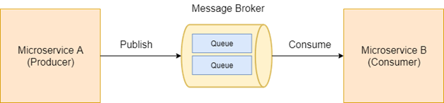

# Microservicios dirigidos por eventos mediante colas

## Patrón de Mensajería
Este proyecto fue basado bajo el siguiente patrón



Existen varias herramientas que implementan este patrón como: 
Apache Kafka, RabbitMQ, ActiveMQ

## Implementación
Para nuestro caso, la comunicación de los microservicios se 
implementará en colas de ActiveMQ


Para ello, nuestros microservicios tendrían los siguientes roles:

### Cards Service
Servicio que alojará el evento (producer) en la cola.
Este evento será notificado luego de crear la tarjeta.

### Products Service
Servicio que se suscribirá al evento (consumer) 
alojado en la cola. Este realizará el calculo del total de productos 
contratados de Tarjeta de Crédito.

### Configuración del Servicio de Tarjetas (Producer)
Definimos la configuración del bean que tendrá la referencia 
de la cola "test-queue", el cual nos permitirá publicar el 
evento en la cola ActiveMQ

```
@Configuration
@EnableJms
public class JmsConfig {

    @Bean
    public Queue queue(){
        return new ActiveMQQueue("test-queue");
    }
}
```

En nuestro controlador, publicamos el evento en la cola 
al crear una tarjeta 

```
public class CardsController {
    @Autowired
    private Queue queue;

    @Autowired
    private JmsTemplate jmsTemplate;
    
    @PostMapping("{card-id}")
    public ResponseEntity<String> createCard(...){
        ...
        jmsTemplate.convertAndSend(queue, cardId);
    }
```

En este caso, el mensaje enviado a la cola es el id de la tarjeta

### Configuración del Servicio de Productos (Consumidor)
En nuestro controlador, habilitamos el listener del Jms para suscribirnos
a la cola y realizar el calculo de las tarjetas cuando nos notifica un evento
```
@EnableJms
public class ProductsController {

    @GetMapping("{product-id}")
    public ResponseEntity<String> getProduct(...){
        ...
    }

    @JmsListener(destination = "test-queue")
    public void listener(String cardId){
        logger.info("Card received {} ", cardId);
        product.incrementTotalContracted();
        logger.info("Product details {} ", product);
    }
```
Nota: La suscripción de la cola se determina mediante el nombre de la cola destino "test-queue"

## Despliegue Local
Para desplegar nuestro entorno local, debemos contar con ActiveMQ 
instalado, descargalo [aquí](https://activemq.apache.org/components/classic/download/)

### ActiveMQ
Iniciar el servicio
>apache-activemq-5.15.9\bin\win64\activemq.bat

>apache-activemq-5.15.9\bin\win32\activemq.bat

Verificar con usuario/clave: admin/admin
>http://localhost:8161/admin

### Despliegue de Servicios

cards-services
> mvn spring-boot:run -Dserver.port=9090

products-services
> mvn spring-boot:run -Dserver.port=8080


## Pruebas

- Importar el set de pruebas en postman
>event-driven-microservices.postman_collection.json

- Ejecutar Detalle de un Producto:
Verificar la cantidad de productos contratados al 
consultar el detalle de productos

- Ejecutar crear tarjeta (publish):
Para crear una tarjeta y publicar el evento

- Verificar nuevamente que la cantidad ha aumentado en 
el servicio de productos